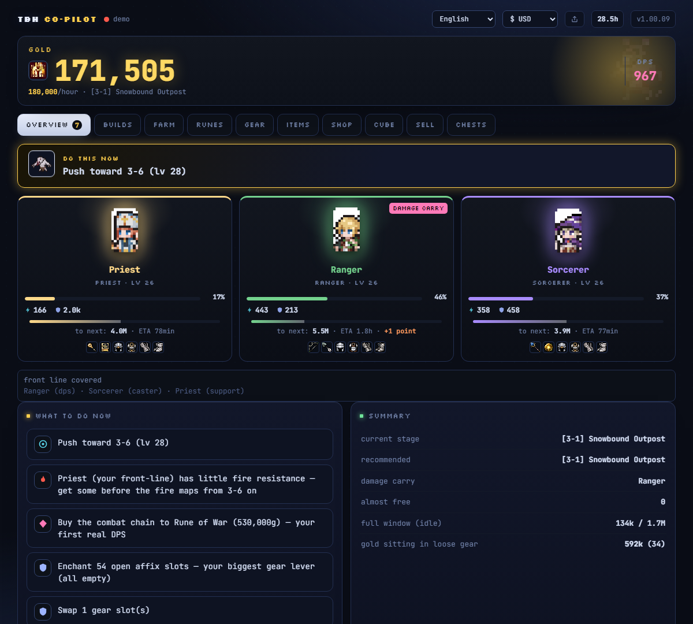
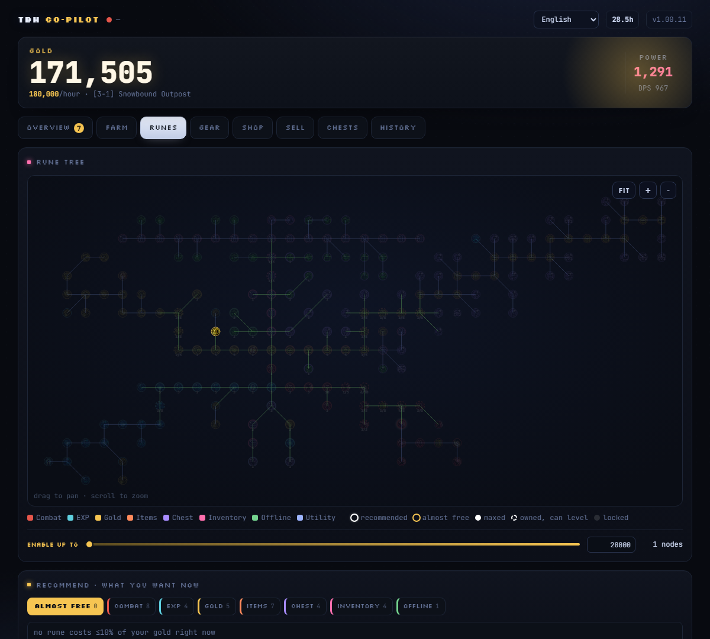
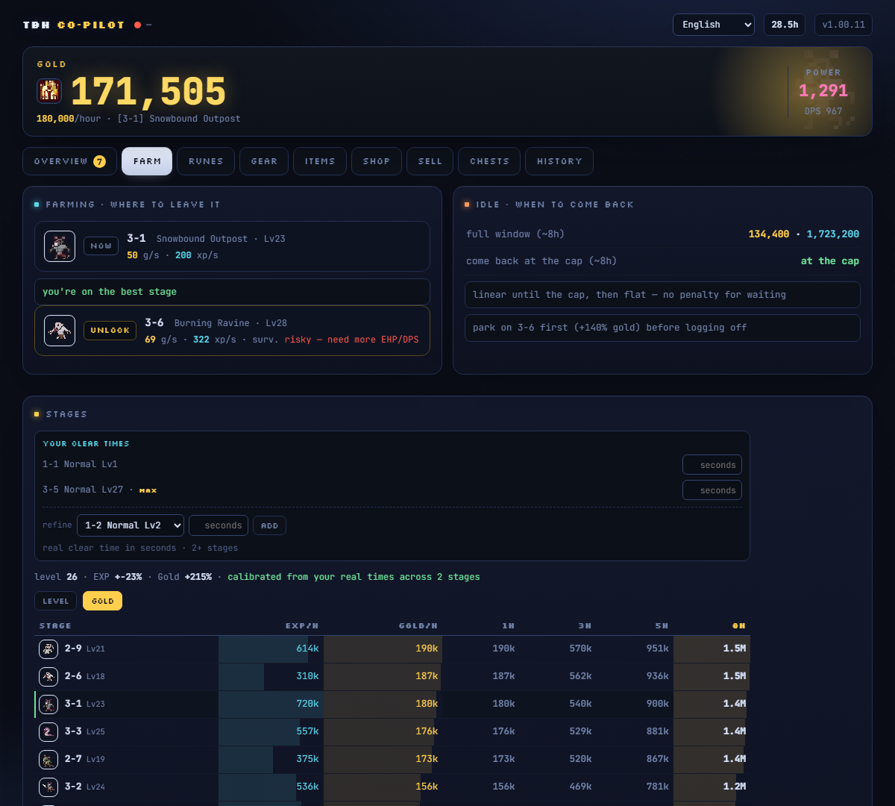

<div align="center">

# TBH Co-pilot

An optimization companion for the idle-RPG [TBH: Task Bar Hero](https://store.steampowered.com/app/3678970/TBH_Task_Bar_Hero/).
It reads your save **locally in the browser**, decrypts it, and tells you the optimal next move: where to
farm, when to come back, when you'll level, which runes and gear to get, and how much power each change buys.

100% local &nbsp;&middot;&nbsp; free, no ads, no tracking &nbsp;&middot;&nbsp; no install, no server &nbsp;&middot;&nbsp; 16 languages



</div>

> Unofficial fan project. Not affiliated with or endorsed by the developers of TBH: Task Bar Hero.
> All game content, names, sprites and data belong to their respective owners. You need to own and run the game.

## Why

Combat is automatic, so the game is less about reflexes and more about decisions: which heroes to field,
where to spend gold, which floor gives the best loot per minute. TBH Co-pilot answers all of that from your
actual save, live, with no spreadsheets and no manual input. Everything is computed in your browser and
nothing ever leaves your machine.

## Features

| Area | What it does |
|---|---|
| **Party roster** | Game sprites, POWER, DPS share, EHP, level and XP/ETA, unspent ability points, equipped gear. Click a hero for a full stat sheet that breaks every stat down by source. |
| **Farm optimizer** | The wiki Farming Optimizer idea, automated. It calibrates your real clear rate from your measured gold/sec and ranks every cleared stage by gold/hour and exp/hour, with a sortable table (clear time, EXP/HP and Gold/HP density). It sends you to the dense, fast stage instead of an unclearable floor. |
| **Idle / return timer** | Offline reward curve, the optimal time to come back (the 8 h cap), and what to park on first. |
| **Interactive rune tree** | All 197 nodes laid out and colored by category. Pick a category (EXP, Combat, Gold, Items, Chest, Inventory, Offline, Utility) and the tree highlights that branch and lists the three cheapest buyable nodes. Almost-free runes are called out. |
| **Gear comparator** | For any slot, the POWER delta of every item: the ones in your bag and the ones you don't have yet (capped to gear you can realistically farm), so you can see what to aim for. |
| **16 languages** | UI and game content localized; the stat model is calibrated against the in-game Status panel. |

<div align="center">


</div>

## Quick start

**Dashboard (`dashboard.html`)**

1. Open it in **any modern browser** (Chrome, Edge, Firefox, etc.).
2. Click Connect save and pick your save:
   - **Windows**: `%USERPROFILE%\AppData\LocalLow\TesseractStudio\TaskbarHero\SaveFile_Live.es3`
   - **Linux (Steam Flatpak)**: `~/.var/app/com.valvesoftware.Steam/.local/share/Steam/steamapps/compatdata/3678970/pfx/drive_c/users/steamuser/AppData/LocalLow/TesseractStudio/TaskbarHero/SaveFile_Live.es3`
   - **Linux (Steam nativo)**: `~/.local/share/Steam/steamapps/compatdata/3678970/pfx/drive_c/users/steamuser/AppData/LocalLow/TesseractStudio/TaskbarHero/SaveFile_Live.es3`
3. Done. In Chrome/Edge it tracks the save live and updates as you play. Other browsers load the save on demand — click the refresh button to re-read. Or click "demo" to look around first.

Everything lives on this one page: an **Overview** (party roster and what-to-do-now), the **Farm**
optimizer, the **Runes** tree, a **Gear** comparator, and **History** charts.

## How it works

The save (encrypted ES3 / AES-CBC) is decrypted with Web Crypto, and the game data the app needs is bundled
into `engine/gamedata.js`. On browsers with the File System Access API (Chrome/Edge) it watches the save
live; on other browsers it falls back to a standard file picker. There are no network calls at runtime,
no backend, and no build step.

One engine drives both surfaces: `engine/engine.js` (UMD, runs in the browser and in Node) computes
effective DPS/EHP/POWER, leveling, the calibrated farm optimizer, idle, the rune tree and planners, and the
gear and enchant deltas. Every tab calls the same `recommend()`. The stat model was checked against
the in-game Status panel so the numbers match what the game shows.

```
index.html            landing page
dashboard.html        the whole app (open this)
engine/               engine.js, gamedata.js, i18n.js, demo.js, build scripts
assets/               game icons and sprites the UI shows
data/                 trimmed stage and rune tables
```

## Privacy and ethics

Your save never leaves your computer. It is read and decrypted locally, with no servers, analytics, or
trackers. The project is free, has no ads, and there is no intention to ever make money from it. Use it,
fork it, self-host it.

## License

Code is [MIT](LICENSE). Game content and assets remain the property of their respective owners (see the
note at the bottom of `LICENSE`).
